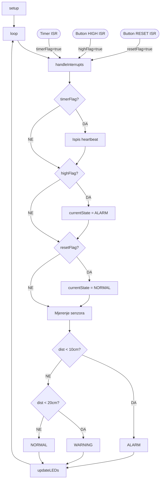

# RUS Lab1 — Upravljanje višestrukim prekidima na ESP32

> **Predmet:** Razvoj ugradbenih sustava (RUS)  
> **Autor:** Bosnjak  
> **Platforma:** ESP32 (Wokwi simulator)  
> **Simulacija:** https://wokwi.com/projects/459371373021514753

---

## Opis zadatka

Implementacija višestrukih prekidnih rutina (ISR) s definiranom hijerarhijom prioriteta na ESP32 mikrokontroleru. Sustav koristi state machine logiku za upravljanje stanjima te štiti dijeljene resurse kritičnim sekcijama (`portMUX_TYPE`).

---

## Komponente i pinovi

| Komponenta      | ESP32 pin | Opis                         |
|-----------------|-----------|------------------------------|
| LED zelena      | GPIO 2    | Indikator stanja NORMAL      |
| LED žuta        | GPIO 15   | Indikator stanja WARNING     |
| LED crvena      | GPIO 18   | Indikator stanja ALARM       |
| Tipkalo HIGH    | GPIO 4    | Prekid visokog prioriteta    |
| Tipkalo RESET   | GPIO 5    | Prekid niskog prioriteta     |
| HC-SR04 TRIG    | GPIO 12   | Ultrazvučni senzor - trigger |
| HC-SR04 ECHO    | GPIO 14   | Ultrazvučni senzor - echo    |

---

## Hijerarhija prioriteta prekida
```
┌─────────────────────────────────────────────────┐
│  P1 - NAJVIŠI  →  Hardware Timer0               │
│  Okida se svakih 2 sekunde, heartbeat poruka    │
├─────────────────────────────────────────────────┤
│  P2 - VISOKI   →  BUTTON_HIGH (GPIO 4)          │
│  Pritisak tipkala → ALARM stanje                │
├─────────────────────────────────────────────────┤
│  P3 - SREDNJI  →  HC-SR04 senzor                │
│  Polling svakih 500ms, WARNING/ALARM po dist.   │
├─────────────────────────────────────────────────┤
│  P4 - NISKI    →  BUTTON_RESET (GPIO 5)         │
│  Pritisak tipkala → NORMAL stanje (reset)       │
└─────────────────────────────────────────────────┘
```

---

## State Machine

| Stanje  | Uvjet aktivacije          | Zelena LED | Žuta LED | Crvena LED |
|---------|---------------------------|-----------|---------|-----------|
| NORMAL  | Početno / nakon reseta    | Trepće    | OFF     | OFF       |
| WARNING | Senzor detektira < 20cm   | OFF       | ON      | OFF       |
| ALARM   | Tipkalo HIGH / < 10cm     | OFF       | OFF     | ON        |

---

## Kontrolni tok programa (CFG)


---

## Nested Interrupts na ESP32

ESP32 (Xtensa LX6) podržava hardverski preemption između razina prekida, za razliku od AVR arhitekture. U projektu:

- ISR funkcije označene s `IRAM_ATTR` — izvršavaju se iz RAM-a
- `portMUX_TYPE mux` — mutex za zaštitu dijeljenih varijabli
- `portENTER_CRITICAL_ISR` / `portEXIT_CRITICAL_ISR` — atomarno postavljanje zastavica

---

## Ispis Serial monitora (dokaz rada)
```
=== RUS Lab1 - Visestruki prekidi ESP32 ===
Prioriteti: Timer(P1) > ButtonHIGH(P2) > Senzor(P3) > ButtonRESET(P4)
[SENSOR P3] Udaljenost: 43 cm
[TIMER P1] Heartbeat #1 | Stanje: NORMAL
[HIGH  P2] ALARM aktiviran tipkalom!
[TIMER P1] Heartbeat #10 | Stanje: ALARM
[RESET P4] Sustav resetiran u NORMAL.
[TIMER P1] Heartbeat #16 | Stanje: NORMAL
```

---

## Generiranje dokumentacije (Doxygen)
```bash
sudo apt install doxygen graphviz
doxygen Doxyfile
# Dokumentacija dostupna na: docs/html/index.html
```

---

## Autor

**Bosnjak** | RUS — Razvoj ugradbenih sustava | TVZ Zagreb 2025. | MIT Licenca
