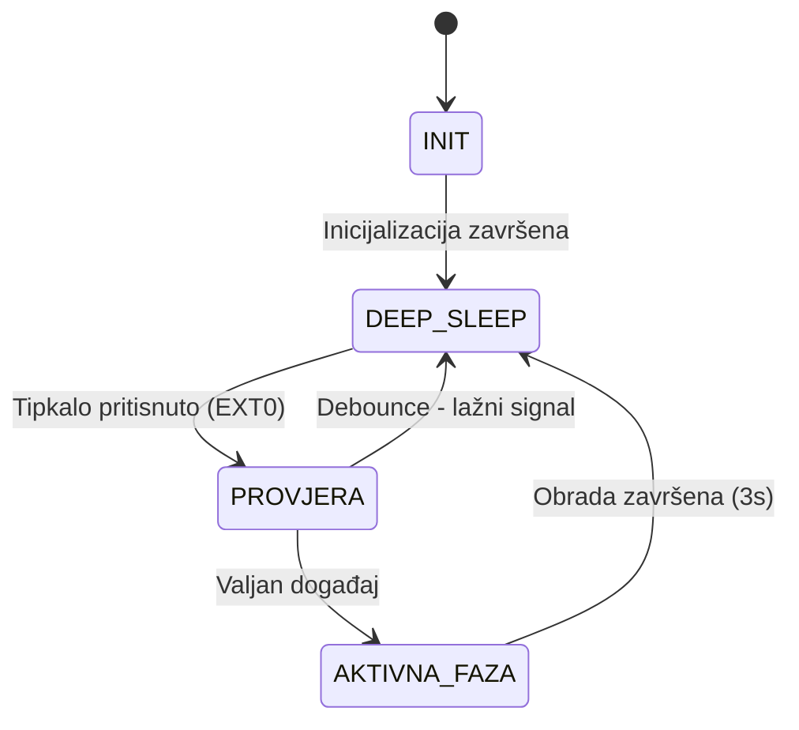

# Izvještaj — RUS Lab2: Pametni poštanski sandučić

## 1. Opis implementacije

Implementiran je sustav pametnog poštanskog sandučića koji koristi ESP32 
Deep Sleep mod za minimizaciju potrošnje energije. Sustav je u mirovanju 
sve dok vanjski događaj (pritisak tipkala) ne aktivira buđenje.

### Faze rada sustava:

**Aktivna faza:**
- ESP32 se budi iz Deep Sleepa
- Evidentira novi paket (inkrement brojača u RTC memoriji)
- Pali LED diodu 3 sekunde (simulacija obrade)
- Ispisuje status na Serial monitor
- Vraća se u Deep Sleep

**Sleep faza:**
- ESP32 u Deep Sleep modu
- Potrošnja svedena na minimum
- Čeka vanjski prekid na GPIO 32

---

## 2. Korišteni režim mirovanja

**Deep Sleep** (`esp_deep_sleep_start()`)

ESP32 podržava više razina sleep modova:

| Sleep mod | Potrošnja | Buđenje |
|-----------|-----------|---------|
| Light Sleep | ~0.8 mA | Timer, GPIO, UART |
| Deep Sleep | ~10 µA | Timer, EXT0, EXT1, Touch |
| Hibernation | ~5 µA | Timer, EXT0 |

Odabran je **Deep Sleep** jer:
- Nudi najmanji utrošak energije uz podršku za EXT0 buđenje
- Podržava RTC memoriju za čuvanje stanja
- Idealan za event-driven scenarije

---

## 3. Način buđenja

**EXT0 vanjski prekid** na GPIO 32 (LOW razina signala).

```cpp
esp_sleep_enable_ext0_wakeup((gpio_num_t)BUTTON_PIN, LOW);
```

Nakon buđenja ESP32 provjerava razlog buđenja:
```cpp
esp_sleep_wakeup_cause_t wakeupReason = esp_sleep_get_wakeup_cause();
if (wakeupReason == ESP_SLEEP_WAKEUP_EXT0) { ... }
```

---

## 4. Čuvanje stanja (RTC memorija)

Varijable označene s `RTC_DATA_ATTR` preživljavaju Deep Sleep:

```cpp
RTC_DATA_ATTR int packageCount = 0;
RTC_DATA_ATTR unsigned long lastWakeTime = 0;
```

Ovo omogućuje praćenje ukupnog broja paketa kroz sve sleep cikluse.

---

## 5. Debouncing

**Odabrana metoda:** Vremensko ignoriranje ponovljenih prekida (300ms)

**Uzrok problema:**
Mehanički prekidači pri aktivaciji generiraju kratkotrajne oscilacije 
signala (bounce), što može uzrokovati višestruko buđenje iz Deep Sleepa.

**Rješenje:**
```cpp
if (now - lastWakeTime < DEBOUNCE_MS && lastWakeTime != 0) {
    // Ignoriraj lažni signal
    return false;
}
```

**Utjecaj na energetsku učinkovitost:**
Bez debouncinga, jedan pritisak tipkala mogao bi uzrokovati 5-10 
neželjenih buđenja, svako trošeći energiju aktivne faze. 
Debouncing osigurava jedan logički događaj = jedno buđenje.

---

## 6. Dijagram stanja



---

## 7. Ograničenja simulacije

Wokwi simulator:
- DA - Podržava testiranje logike sleep/wake ciklusa
- DA - Podržava EXT0 buđenje i RTC memoriju
- NE - Ne simulira stvarnu potrošnju energije
- NE - Podrška za napredne sleep modove je ograničena

**Zaključak:** Implementacija prikazuje logiku upravljanja energijom, 
ali ne omogućuje stvarnu procjenu potrošnje energije. Za stvarnu 
analizu preporučuje se rad na hardverskoj platformi s mjeračem struje.

---

## 8. Wokwi simulacija

**Link:** (https://wokwi.com/projects/463348291726456833)
