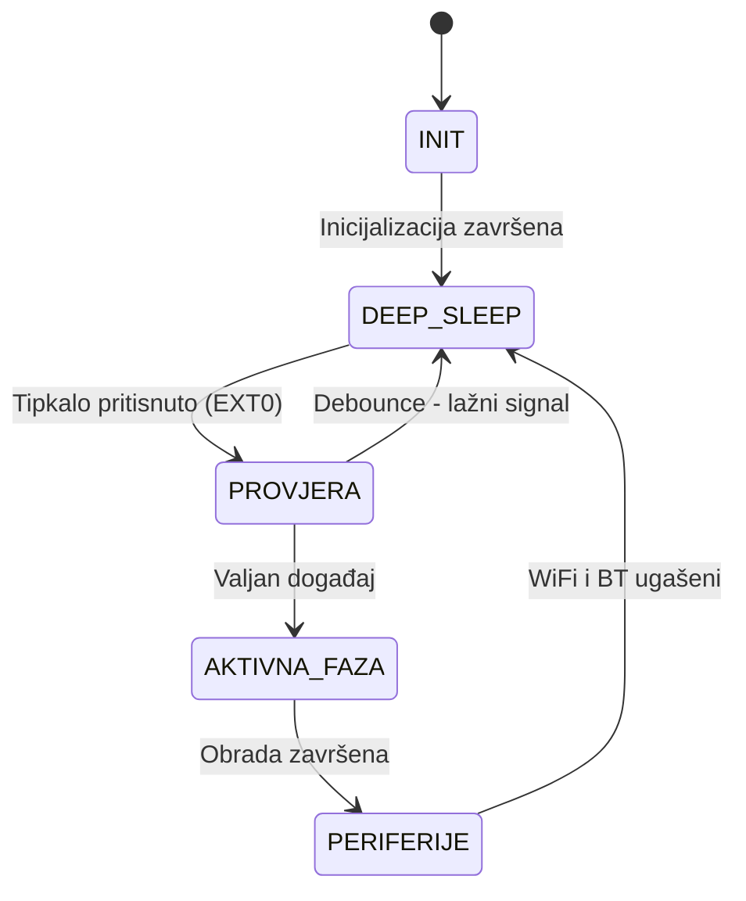

> **Napomena:** Ovo je teorijski izračun. Stvarna potrošnja ovisi o
> frekvenciji pritiska tipkala, temperaturi i kvaliteti baterije.

---

## 8. Dijagram stanja

---

## 9. Ograničenja simulacije

Wokwi simulator:
- DA - Podržava testiranje logike sleep/wake ciklusa
- DA - Podržava EXT0 buđenje i RTC memoriju
- NE - Ne simulira stvarnu potrošnju energije
- NE - Podrška za napredne sleep modove je ograničena

**Zaključak:** Implementacija prikazuje logiku upravljanja energijom,
ali ne omogućuje stvarnu procjenu potrošnje energije. Za stvarnu
analizu preporučuje se rad na hardverskoj platformi s mjeračem struje.

---

## 10. Sažetak

| Stavka | Odgovor |
|--------|---------|
| Platforma | ESP32 |
| Varijanta | A — Pametni poštanski sandučić |
| Sleep mode | Deep Sleep (`esp_deep_sleep_start()`) |
| Buđenje | Vanjski prekid EXT0 na GPIO 32 |
| Čuvanje stanja | RTC memorija (`RTC_DATA_ATTR`) |
| Debouncing | Vremensko ignoriranje (300ms) |
| Wokwi link | (https://wokwi.com/projects/463348291726456833) |
