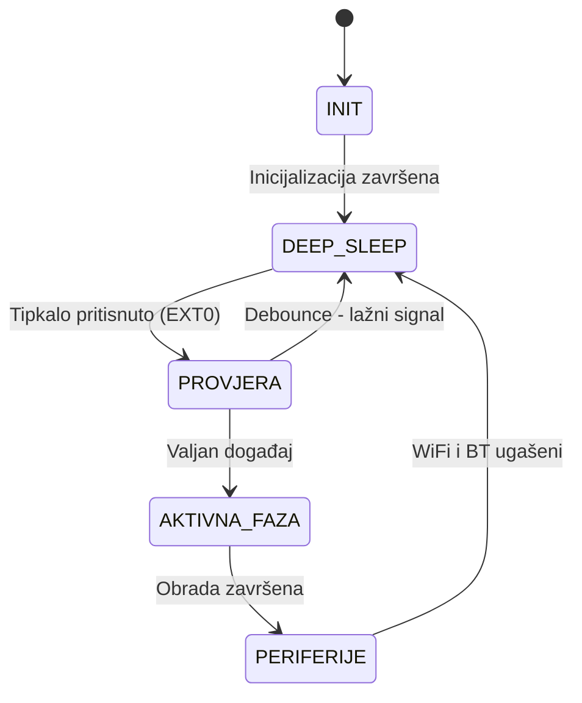

# Izvještaj — RUS Lab2: Pametni poštanski sandučić

## 1. Opis implementacije

Implementiran je sustav pametnog poštanskog sandučića koji koristi ESP32
Deep Sleep mod za minimizaciju potrošnje energije. Sustav je u mirovanju
sve dok vanjski događaj (pritisak tipkala) ne aktivira buđenje.

### Faze rada sustava:

**Aktivna faza:**
- ESP32 se budi iz Deep Sleepa
- Evidentira novi paket (inkrement brojača u RTC memoriji)
- Pali LED diodu 3 sekunde (simulacija obrade)
- Ispisuje status na Serial monitor
- Vraća se u Deep Sleep

**Sleep faza:**
- ESP32 u Deep Sleep modu (~10 µA)
- WiFi i Bluetooth onemogućeni prije ulaska
- Čeka vanjski prekid na GPIO 32

---

## 2. Istraživanje i usporedba režima mirovanja

### ESP32 sleep modovi

| Sleep mod | Potrošnja | Vrijeme buđenja | RAM | RTC memorija | Mogućnosti buđenja |
|-----------|-----------|-----------------|-----|--------------|-------------------|
| Light Sleep | ~0.8 mA | ~1 ms | Sačuvan | Da | Timer, GPIO, UART |
| Deep Sleep | ~10 µA | ~10 ms | Izgubljen | Da | Timer, EXT0, EXT1, Touch |
| Hibernation | ~5 µA | ~10 ms | Izgubljen | Ne | Samo timer, RTC GPIO |

### Usporedba prema kriterijima

**Logičko ponašanje sustava:**
- **Light Sleep** — CPU pauzira ali RAM ostaje aktivan, program nastavlja od mjesta gdje je stao
- **Deep Sleep** — CPU se gasi, RAM se briše, program kreće iznova od `setup()`
- **Hibernation** — Najdublji mod, gasi se sve osim RTC timera, nema RTC memorije

**Vrijeme buđenja:**
- Light Sleep je najbrži (~1ms) jer ne treba reinicijalizaciju
- Deep Sleep i Hibernation trebaju ~10ms jer se sustav restarta

**Mogućnosti konfiguracije:**
- Light Sleep nudi najviše fleksibilnosti (više izvora buđenja istovremeno)
- Deep Sleep balansira potrošnju i funkcionalnost — **odabran za ovaj projekt**
- Hibernation je najrestriktivniji ali troši najmanje energije

### Odabir za ovaj projekt

Odabran je **Deep Sleep** jer:
- Nudi dovoljno nisku potrošnju (~10 µA)
- Podržava EXT0 buđenje putem tipkala
- Podržava RTC memoriju za čuvanje broja paketa
- Idealan za event-driven scenarije poput poštanskog sandučića

---

## 3. Način buđenja

**EXT0 vanjski prekid** na GPIO 32 (LOW razina signala).

```cpp
esp_sleep_enable_ext0_wakeup((gpio_num_t)BUTTON_PIN, LOW);
```

Nakon buđenja ESP32 provjerava razlog buđenja:
```cpp
esp_sleep_wakeup_cause_t wakeupReason = esp_sleep_get_wakeup_cause();
if (wakeupReason == ESP_SLEEP_WAKEUP_EXT0) { ... }
```

---

## 4. Čuvanje stanja (RTC memorija)

Varijable označene s `RTC_DATA_ATTR` preživljavaju Deep Sleep:

```cpp
RTC_DATA_ATTR int packageCount = 0;
RTC_DATA_ATTR unsigned long lastWakeTime = 0;
```

Ovo omogućuje praćenje ukupnog broja paketa kroz sve sleep cikluse.

---

## 5. Debouncing

**Odabrana metoda:** Vremensko ignoriranje ponovljenih prekida (300ms)

**Uzrok problema:**
Mehanički prekidači pri aktivaciji generiraju kratkotrajne oscilacije
signala (bounce), što može uzrokovati višestruko buđenje iz Deep Sleepa.

**Rješenje:**
```cpp
if (now - lastWakeTime < DEBOUNCE_MS && lastWakeTime != 0) {
    return false; // Ignoriraj lažni signal
}
```

**Utjecaj na energetsku učinkovitost:**
Bez debouncinga, jedan pritisak tipkala mogao bi uzrokovati 5-10
neželjenih buđenja, svako trošeći energiju aktivne faze.
Debouncing osigurava jedan logički događaj = jedno buđenje.

---

## 6. Upravljanje periferijama

Prije ulaska u Deep Sleep onemogućavaju se nepotrebne periferije:

```cpp
WiFi.disconnect(true);
WiFi.mode(WIFI_OFF);
btStop();
```

Ovo dodatno smanjuje potrošnju energije tijekom sleep faze.

---

## 7. Teorijsko trajanje baterije

**Pretpostavke:**
- Baterija: 2500 mAh
- Aktivna faza: 3 sekunde, potrošnja ~160 mA
- Sleep faza: prosječno 60 sekundi između paketa, potrošnja ~0.01 mA

**Formula:**
I_avg = (I_active × t_active + I_sleep × t_sleep) / ukupno vrijeme
I_avg = (160 mA × 3s + 0.01 mA × 60s) / 63s
I_avg = (480 + 0.6) / 63
I_avg ≈ 7.63 mA

**Trajanje baterije:**
T = kapacitet / I_avg
T = 2500 mAh / 7.63 mA
T ≈ 327 sati ≈ 13.6 dana

> **Napomena:** Ovo je teorijski izračun. Stvarna potrošnja ovisi o
> frekvenciji pritiska tipkala, temperaturi i kvaliteti baterije.

---

## 8. Dijagram stanja



---

## 9. Ograničenja simulacije

Wokwi simulator:
- DA - Podržava testiranje logike sleep/wake ciklusa
- DA - Podržava EXT0 buđenje i RTC memoriju
- NE - Ne simulira stvarnu potrošnju energije
- NE - Podrška za napredne sleep modove je ograničena

**Zaključak:** Implementacija prikazuje logiku upravljanja energijom,
ali ne omogućuje stvarnu procjenu potrošnje energije. Za stvarnu
analizu preporučuje se rad na hardverskoj platformi s mjeračem struje.

---

## 10. Sažetak

| Stavka | Odgovor |
|--------|---------|
| Platforma | ESP32 |
| Varijanta | A — Pametni poštanski sandučić |
| Sleep mode | Deep Sleep (`esp_deep_sleep_start()`) |
| Buđenje | Vanjski prekid EXT0 na GPIO 32 |
| Čuvanje stanja | RTC memorija (`RTC_DATA_ATTR`) |
| Debouncing | Vremensko ignoriranje (300ms) |
| Wokwi link | (https://wokwi.com/projects/463348291726456833) |
