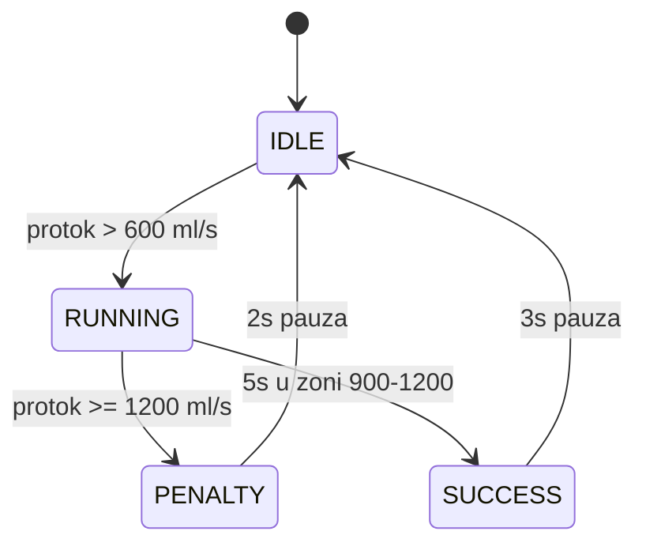

# PuffRacer – Spirometar za kontrolu trkačeg auta

> **Predmet:** Razvoj ugradbenih sustava (RUS)  
> **Tim:** BVB — Toma Bošnjak & Borna Šafar  
> **Platforma:** ESP32 (Wokwi simulator)  
> **Simulacija:** [Otvori na Wokwi](https://wokwi.com/projects/465526973084188673)

---

## Opis projekta

PuffRacer je ugradbeni sustav koji simulira medicinski spirometar u obliku F1 utrke.
Korisnik okreće potenciometar (simulacija puhanja) i pokušava držati protok daha
u optimalnoj zoni između 900 i 1200 ml/s točno 5 sekundi.
Najbolji rezultat sprema se u NVS memoriju ESP32 i ostaje i nakon gašenja.

---

## Zamišljeni uređaj

Uređaj se sastoji od:
- **ESP32 mikrokontrolera** kao glavne upravljačke jedinice
- **Potenciometra** kao simulacije senzora puhanja
- **LED dioda** (zelena, žuta, crvena) kao indikatora razine protoka
- **OLED zaslona** za prikaz trenutnog stanja vježbe i rekorda

---

## Komponente i pinovi

| Komponenta    | ESP32 pin  | Opis                         |
|---------------|------------|------------------------------|
| Potenciometar | GPIO 34    | Simulacija protoka daha      |
| OLED zaslon   | GPIO 21/22 | Prikaz stanja (I2C)          |
| LED zelena    | GPIO 26    | Razina 1 — 600 ml/s          |
| LED žuta      | GPIO 27    | Razina 2 — 900 ml/s          |
| LED crvena    | GPIO 25    | Razina 3 — 1200 ml/s (kazna) |

---

## Funkcionalnosti

| Intenzitet puhanja | Protok      | Stanje auta        | LED indikator |
|--------------------|-------------|--------------------|---------------|
| Nema puhanja       | < 600 ml/s  | Auto stoji         | Sve ugašeno   |
| Slabo puhanje      | 600-899     | Sporo vozi         | Zelena        |
| Optimalna zona     | 900-1199    | Maksimalna brzina  | Žuta          |
| Prejako puhanje    | ≥ 1200      | KAZNA - prolijevanje| Crvena       |

---

## Logika vježbe

- Korisnik mora držati protok između **900 i 1200 ml/s** neprekidno **5 sekundi**
- Ako protok prijeđe 1200 ml/s → **KAZNA**, vježba se poništava
- Uspješna vježba → rezultat se uspoređuje s rekordom i sprema u NVS



---

## Tehnička implementacija

- Očitavanje potenciometra (ADC, 12-bit)
- EMA filtriranje signala (koeficijent 0.2)
- Mapiranje vrijednosti na protok (0-1400 ml/s)
- Upravljanje LED diodama prema razini protoka
- OLED prikaz protoka, bar indikatora i stanja vježbe
- Spremanje najboljeg rezultata u NVS memoriju

---

## Napredna funkcija

**Spremanje rezultata u NVS memoriju** — najbolji postignuti protok
se sprema i učitava pri svakom pokretanju, čak i nakon gašenja ESP32.

```cpp
prefs.begin("puffracer", false);
prefs.putFloat("best", result);
prefs.end();
```

---

## Tim — BVB

- **Toma Bošnjak**
- **Borna Šafar**

**RUS — Razvoj ugradbenih sustava | TVZ Zagreb 2025. | MIT Licenca**
