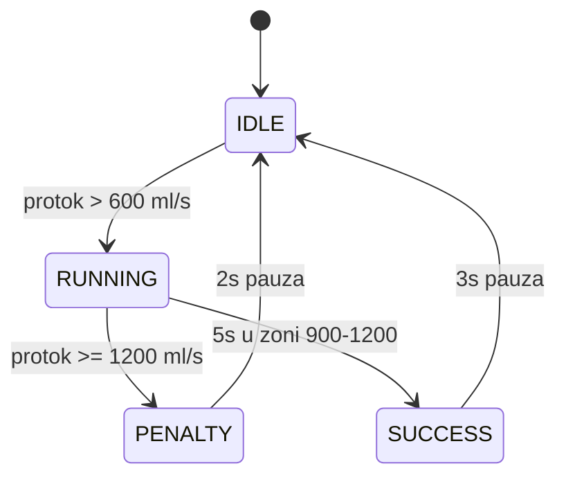

# Izvještaj — PuffRacer: Spirometar za kontrolu trkaćeg auta

## 1. Opis implementacije

PuffRacer simulira medicinski spirometar u obliku F1 utrke.
Korisnik okreće potenciometar koji emulira protok daha.
Sustav mjeri, filtrira i obrađuje signal te prikazuje stanje
na OLED zaslonu i LED diodama.

### Faze rada:

**IDLE:**
- Sustav čeka da korisnik započne vježbu
- Protok ispod 600 ml/s — sve LED ugašene

**RUNNING:**
- Korisnik aktivno "puše" (okreće potenciometar)
- Sustav mjeri protok svakih 50ms
- Brojač teče kada je protok u zoni 900-1200 ml/s

**SUCCESS:**
- Korisnik je zadržao protok 5 sekundi u optimalnoj zoni
- Rezultat se uspoređuje s rekordom i sprema u NVS

**PENALTY:**
- Protok je prešao 1200 ml/s
- Vježba se poništava, 2 sekunde pauze

---

## 2. Tehnička specifikacija

### Akvizicija signala

Potenciometar spojen na GPIO 34 (12-bit ADC):
```cpp
int raw = analogRead(POT_PIN);
float flow = map(raw, 0, 4095, FLOW_MIN, FLOW_MAX);
```

### EMA Filtriranje

Eksponencijalni klizni prosjek za zaglađivanje signala:
```cpp
emaFlow = EMA_ALPHA * flow + (1 - EMA_ALPHA) * emaFlow;
```
Koeficijent α = 0.2 — sustav ne "trza" ali nije ni "lijen".

### Pragovi protoka

| Razina | Protok     | Stanje          | LED    |
|--------|------------|-----------------|--------|
| 0      | < 600      | Auto stoji      | OFF    |
| 1      | 600-899    | Sporo vozi      | Zelena |
| 2      | 900-1199   | Optimalna zona  | Žuta   |
| 3      | ≥ 1200     | KAZNA!          | Crvena |

---

## 3. Logika vježbe

Uvjeti za uspješnu vježbu:
- Protok između 900 i 1200 ml/s
- Neprekidno trajanje od 5 sekundi
- Ako protok prijeđe 1200 ml/s → KAZNA, reset



---

## 4. Napredna funkcija — NVS memorija

Najbolji rezultat se sprema u NVS (Non-Volatile Storage) memoriju
ESP32 i preživljava gašenje uređaja.

```cpp
// Spremanje
prefs.begin("puffracer", false);
prefs.putFloat("best", result);
prefs.end();

// Učitavanje
prefs.begin("puffracer", true);
float best = prefs.getFloat("best", 0);
prefs.end();
```

---

## 5. OLED prikaz

Zaslon prikazuje:
- Trenutni protok u ml/s
- Bar indikator s pragovima
- Trenutno stanje vježbe
- Najbolji rezultat (rekord)

---

## 6. Ograničenja simulacije

- Potenciometar nije idealna simulacija puhanja
- Wokwi ne simulira stvarnu pneumatsku fiziku
- NVS memorija se resetira pri svakom pokretanju simulacije

---

## 7. Sažetak

| Stavka | Odgovor |
|--------|---------|
| Platforma | ESP32 |
| Simulacija puhanja | Potenciometar (ADC GPIO 34) |
| Prikaz | OLED SSD1306 (I2C) |
| Filtriranje | EMA (α = 0.2) |
| Pragovi | 600 / 900 / 1200 ml/s |
| Uvjet uspjeha | 5s u zoni 900-1200 ml/s |
| Napredna funkcija | NVS memorija |
| Wokwi link | [Otvori projekt](https://wokwi.com/projects/465526973084188673) |

---

## Autori

**Toma Bošnjak & Borna Šafar**  
RUS — Razvoj ugradbenih sustava | TVZ Zagreb 2025.
